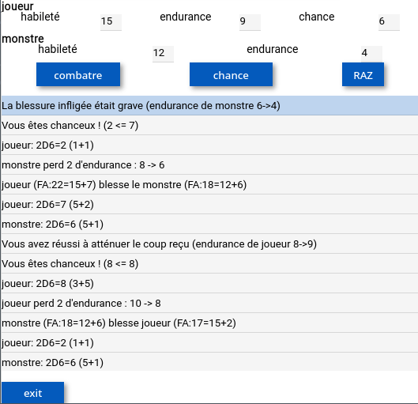

# ldvelh_calc
Un calculateur de combats pour le livre dont vous êtes le héros en remi

Ce calculateur est issu uniquement du livre "Les collines maléfiques" et "a l'air de fonctionner".
En fait ce projet est juste un test pour que je prenne en main la GUI python [remi](https://github.com/rawpython/remi/).

# Usage
* installer un navigateur, python et remi.
* Télécharger les deux fichiers .py et lancer ldvelh_calc.py.

Testé sous linux et android (termux).
